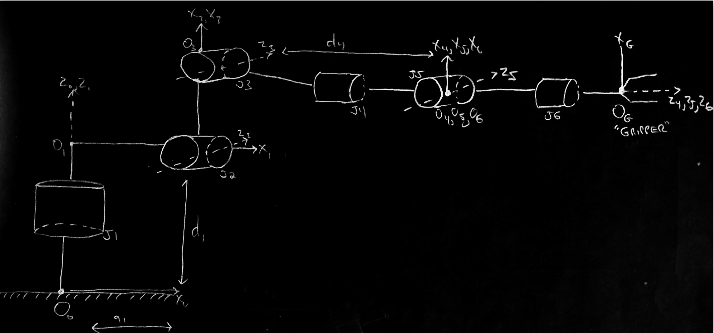
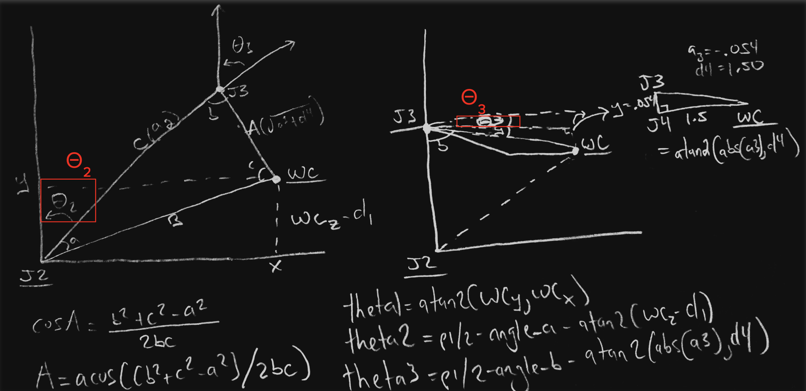
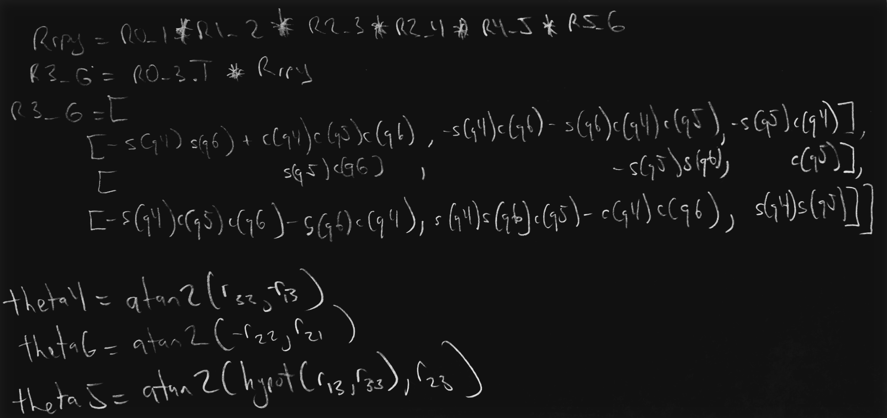

[](https://www.udacity.com/robotics)

## Kinematics (Robotic Arm) Pick & Place Project
### Writeup by Ayo Adedeji

---
#### Instructions on how to setup Gazebo, ROS and other dependencies can be found [here](./setup_guide.md).

## [Rubric](https://review.udacity.com/#!/rubrics/972/view) Points
---
### Kinematic Analysis
#### 1. Extract joint positions and orientations from kr210.urdf.xacro file to perform kinematic analysis of Kuka KR210 robot and derive its DH parameters.

To extract joint positions and orientations from kr210.urdf.xacro, find the origin element of each joint tag in the urdf file. The origin element declares the axis of rotation/translation and the relationship between the two links that form the joint. For demonstration purposes, joint tags (as provided in urdf file) for the first two joints of the robotic arm are added below.

```xml
 <!-- joints -->
  <joint name="fixed_base_joint" type="fixed">
    <parent link="base_footprint"/>
    <child link="base_link"/>
    <origin xyz="0 0 0" rpy="0 0 0"/>
  </joint>
  <joint name="joint_1" type="revolute">
    <origin xyz="0 0 0.33" rpy="0 0 0"/>
    <parent link="base_link"/>
    <child link="link_1"/>
    <axis xyz="0 0 1"/>
    <limit lower="${-185*deg}" upper="${185*deg}" effort="300" velocity="${123*deg}"/>
  </joint>
  ...
<!-- joints -->
```
Extracting all positions and orientations for each joint(from fixed based joint to gripper) results in table below:

i | joint | parent | child | x | y | z | r | p | y |
--- | --- | --- | --- | --- | --- | --- | --- | --- | --- |
0 | fixed_base_joint | base_footprint | base_link | 0 | 0 | 0 | 0 | 0 | 0 |
1 | joint_1 | base_link | link_1 | 0 | 0 | 0.33 | 0 | 0 | 0 |
2 | joint_2 | link_1 | link_2 | 0 .35| 0 | 0.42 | 0 | 0 | 0 |
3 | joint_3 | link_2 | link_3 | 0 | 0 | 1.25 | 0 | 0 | 0 |
4 | joint_4 | link_3 | link_4 | 0.96 | 0 | -0.054 | 0 | 0 | 0 |
5 | joint_5 | link_4 | link_5 | 0.54 | 0 | 0 | 0 | 0 | 0 |
6 | joint_6 | link_5 | link_6 | 0.193 | 0 | 0 | 0 | 0 | 0 |
7 | gripper_joint | link_6 | gripper_link | 0.11 | 0 | 0 | 0 | 0 | 0 |

The DH parameter table below is derived from above table of joint positions and orientations. Drawing of kuka arm in its zero configuration is provided to faciliate visualization of how each joint frame relates to the next:

Links | α<sub>i-1</sub> | a<sub>i-1</sub> | d<sub>i-1</sub> | Θ<sub>i</sub>
--- | --- | --- | --- | ---
0->1 | 0 | 0 | 0.75 | Θ<sub>1</sub>
1->2 | - pi/2 | 0.35 | 0 | Θ<sub>2</sub> - pi/2
2->3 | 0 | 1.25 | 0 | Θ<sub>3</sub>
3->4 |  -pi/2 | -0.054 | 1.50 | Θ<sub>4</sub>
4->5 | pi/2 | 0 | 0 | Θ<sub>5</sub>
5->6 | -pi/2 | 0 | 0 | Θ<sub>6</sub>
6->EE | 0 | 0 | 0.303 | 0

* DH parameter convention from Craig, JJ. (2005). Introduction to Robotics: Mechanics and Control, 3rd Ed (Pearson Education, Inc., NJ)
* α<sub>i-1</sub>  (twist angle) : angle from Z<sub>i-1</sub> to Z<sub>i</sub> measured along X<sub>i-1</sub>
* a<sub>i-1</sub> (link length): distance from Z<sub>i-1</sub> to Z<sub>i</sub> measured along X<sub>i-1</sub>
* d<sub>i</sub>  (link offset) : distance from X<sub>i-1</sub> to X<sub>i</sub> measured along Z<sub>i</sub>
* Θ<sub>i</sub>  (joint angle) : angle from X<sub>i-1</sub> to X<sub>i</sub> measured along Z<sub>i</sub>

<p align="center">  </p>

#### 2. Using the DH parameter table you derived earlier, create individual transformation matrices about each joint. In addition, also generate a generalized homogeneous transform between base_link and gripper_link using only end-effector(gripper) pose.

* To get total transform from frame 0 to frame EE, compose individual transformation matrices together (i.e <sup>0</sup>T<sub>1</sub>, <sup>1</sup>T<sub>2</sub>…..<sup>6</sup>T<sub>EE</sub>)
* <sup>0</sup>R<sub>6</sub> = Rrpy
* <sup>0</sup>T<sub>EE</sub>  can also be expressed in terms of Rrpy and the end effector pose (a 4 x 4 real value transformation matrix). This method involves solving 12 nonlinear equations for each term in the first three rows of the real value transformation matrix.

Import required python modules
```python
import numpy as np
from sympy import *
```

Python code to generate homogeneous transform from joint frame {i-1} to {frame i}
```python
def TF_matrix(alpha, a, d, sq, cq):
    """
    Generate homogeneous transform from frame {i-1} to {frame i}
    using DH parameters descriptive of frame{i-1} and frame {i}
    Inputs:
        alpha (symbol) # twist angle
        a (symbol) # link length
        d (symbol) # link offset
        sq (symbol) # sin(theta)
        cq (symbol) # cos(theta)
    Returns:
        TF (Matrix)
    Returns:
    """
    TF = Matrix([
        [           cq,           -sq,           0,             a],
        [sq*cos(alpha), cq*cos(alpha), -sin(alpha), -sin(alpha)*d],
        [sq*sin(alpha), cq*sin(alpha),  cos(alpha),  cos(alpha)*d],
        [             0,            0,           0,             1]])
    return TF
```

```python
# create individual transformation matrices
alpha, a, d, sq, cq = symbols('alpha a d sq cq')
Ti_j = lambdify([alpha, a, d, sq, cq], TF_matrix(alpha, a, d, sq, cq))
T0_1 = Matrix(Ti_j(dh[alpha0], dh[a0], dh[d1], sin(q1), cos(q1)))
T1_2 = Matrix(Ti_j(dh[alpha1], dh[a1], dh[d2], sin(dh[q2]), cos(dh[q2])))
T2_3 = Matrix(Ti_j(dh[alpha2], dh[a2], dh[d3], sin(q3), cos(q3)))
T3_4 = Matrix(Ti_j(dh[alpha3], dh[a3], dh[d4], sin(q4), cos(q4)))
T4_5 = Matrix(Ti_j(dh[alpha4], dh[a4], dh[d5], sin(q5), cos(q5)))
T5_6 = Matrix(Ti_j(dh[alpha5], dh[a5], dh[d6], sin(q6), cos(q6)))
T6_EE = Matrix(Ti_j(dh[alpha6], dh[a6], dh[d7], sin(dh[q7]), cos(dh[q7])))
T0_EE = T0_1 * T1_2 * T2_3 * T3_4 * T4_5 * T5_6 * T6_EE
```

##### &ast; Sympy's Lambdify() used in place of conventional evalf() or sub() to optimize speed

#### 3. Decouple Inverse Kinematics problem into Inverse Position Kinematics and inverse Orientation Kinematics; doing so derive the equations to calculate all individual joint angles.

Deriving individual joint angles (Θ<sub>1</sub>, Θ<sub>2</sub>, Θ<sub>3</sub>):
<p align="center">  </p>

```python
# define theta1, theta2, theta3
theta1 = atan2(WC[1], WC[0])
theta2 = pi / 2 - angle_a - atan2(WC[2] - dh[d1], hypot(WC[0], WC[1]) - dh[a1])
theta3 = pi / 2 - angle_b - atan2(-dh[a3], dh[d4])
```

Deriving individual joint angles (Θ<sub>4</sub>, Θ<sub>5</sub>, Θ<sub>6</sub>):
<p align="center">  </p>

```python
# define theta5
theta5 = atan2(hypot(R3_6[0,2], R3_6[2,2]), R3_6[1,2])
theta5_ps_angular_distance = get_shortest_angular_distance_within_limits(
    previous_theta5, theta5, lower_joint_limit, upper_joint_limit)
theta5_ns_angular_distance = get_shortest_angular_distance_within_limits(
    previous_theta5, -theta5, lower_joint_limit, upper_joint_limit)
if abs(theta5_ps_angular_distance) < abs(theta5_ns_angular_distance):
    theta5 = previous_theta5 + theta5_ps_angular_distance
else:
    theta5 = previous_theta5 + theta5_ns_angular_distance
# define theta4, theta6 (w/ conditional to ensure consistent solution selection)
if sin(theta5) >= 0:
    theta4 = atan2(R3_6[2,2], -R3_6[0,2])
    theta6 = atan2(-R3_6[1,1], R3_6[1,0])
else:
    theta4 = atan2(-R3_6[2,2], R3_6[0,2])
    theta6 = atan2(R3_6[1,1], -R3_6[1,0])
theta4 = previous_theta4 + get_shortest_angular_distance_within_limits(
    previous_theta4, theta4, lower_joint_limit, upper_joint_limit)
theta6 = previous_theta6 + get_shortest_angular_distance_within_limits(
    previous_theta6, theta6, lower_joint_limit, upper_joint_limit)
```

### Project Implementation

#### 1. Fill in the `IK_server.py` file with properly commented python code for calculating Inverse Kinematics based on previously performed Kinematic Analysis. Your code must guide the robot to successfully complete 8/10 pick and place cycles. Briefly discuss the code you implemented and your results. 

##### Multiple Solutions Selection
To address potential for multiple solutions when solving for Θ<sub>4</sub>,Θ<sub>5</sub>, and Θ<sub>6</sub>, solve for Θ<sub>5</sub> and -Θ<sub>5</sub> and choose Θ5 solution of shortest angular distance from previous or initial Θ<sub>5</sub>. Use sign of Θ<sub>5</sub> to determine Θ<sub>4</sub>  and Θ<sub>6</sub>  to ensure consistent solution selection  (i.e atan2(y, -x) vs atan2(-y, x))  of Θ<sub>4</sub>, Θ<sub>5</sub> for a given Θ<sub>5</sub>
* View python code snippet pertaining to Θ<sub>4</sub>,Θ<sub>5</sub>, and Θ<sub>6</sub> derivations for more details

##### Prevent Excessive Rotation
To prevent excessive rotation Θ<sub>4</sub>,Θ<sub>5</sub>, and Θ<sub>6</sub> should be defined in terms of angle corresponding to shortest angular distance from previous Θ<sub>4</sub>,Θ<sub>5</sub>, and Θ<sub>6</sub>  within joint trajectory list. Only define Θ<sub>4</sub>,Θ<sub>5</sub>, and Θ<sub>6</sub> to angles within joint limits specified in URDF (L:-350,U:350)

To get initial Θ<sub>4</sub>,Θ<sub>5</sub>, and Θ<sub>6</sub> make service request to /gazebo/get_joint_properties

Python code to get shortest angular distance from a given previous / initial joint angle to current joint angle
```python
from angles import shortest_angular_distance_with_limits
def get_shortest_angular_distance_within_limits(from_theta, to_theta, left_limit, right_limit):
    """
    Get angle that corresponds to the shortest angular distance within left and right limits 
    from 'from_theta' angle to 'to_theta' angle
    Inputs:
        from_theta (float) # radians
        to_theta (float)  # radians
        left_limit (float) # radians
        right_limit (float) # radians
    Returns:
        shortest_angular_distance (float) # radians
    """
    shortest_angular_distance = shortest_angular_distance_with_limits(
        from_theta, 
        to_theta, 
        left_limit + from_theta, 
        right_limit + from_theta)[1]
    new_theta = from_theta + shortest_angular_distance
    if left_limit <= new_theta <= right_limit:
        return shortest_angular_distance
    return -np.sign(new_theta) * (radians(360) - abs(shortest_angular_distance))
```

```python
# request initial theta4, theta5, and theta6 from gazebo
try:
    get_joint_properties = rospy.ServiceProxy('/gazebo/get_joint_properties', GetJointProperties)
    previous_theta4 = get_joint_properties('joint_4').position[0]
    previous_theta5 = get_joint_properties('joint_5').position[0]
    previous_theta6 = get_joint_properties('joint_6').position[0]
except rospy.ServiceException as e:
    rospy.logerr('Get joint properties request failed.')
```
Here I'll talk about the code, what techniques I used, what worked and why, where the implementation might fail and how I might improve it if I were going to pursue this project further.  


And just for fun, another example image:
![alt text][image3]


